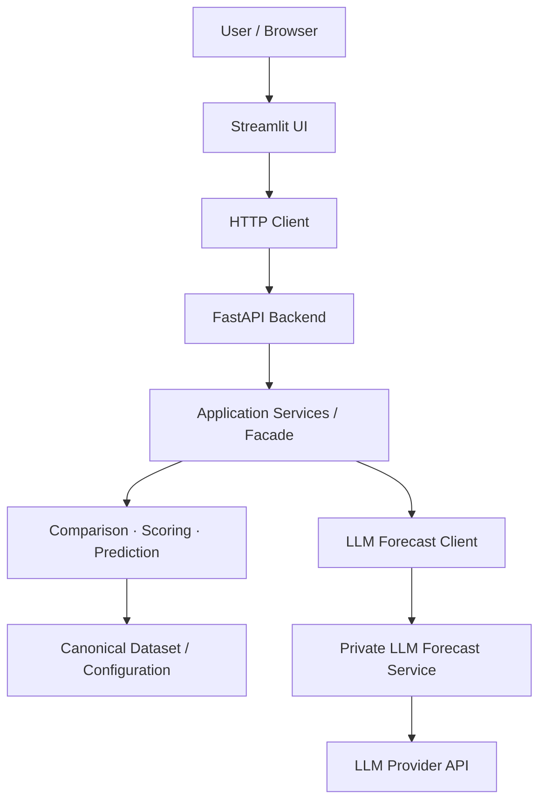

# Country Compare

[](https://github.com/IlyaMich/country-compare/actions/workflows/ci.yaml)
[](https://github.com/IlyaMich/country-compare/releases)

[](LICENSE)

**Country Compare** is a full-stack Python application for exploring and comparing countries across economic, health, governance, and social indicators.

It provides interactive country comparisons, weighted scoring, historical analysis, deterministic forecasting, backtesting, and an optional LLM-assisted forecasting method. The application is built around a framework-independent domain and service layer exposed through a FastAPI backend and a Streamlit UI.

The project is containerized and designed to support independently deployable UI, API, and LLM forecasting services.

> **Live demo:** [Open Country Compare](https://country-compare-ui.onrender.com) (IMPORTANT: The UI, API and LLM services will require some time to spin up due to Render constraints)


## Why I built this

Country Compare started as a country-data analysis application and evolved into a production-style software engineering project.

Beyond the comparison functionality itself, the project explores several engineering concerns that commonly appear in real applications:

- clear separation between domain logic, application services, API transport, clients, and presentation;
- REST API design with structured request/response contracts and consistent error handling;
- independently deployable frontend, backend, and private LLM services;
- deterministic forecasting with diagnostics, backtesting, and explicit fallback behavior;
- bounded LLM-assisted forecasting rather than unrestricted model-generated predictions;
- containerized development and deployment;
- automated testing, linting, type checking, container validation, and CI/CD;
- operational health, readiness, request tracing, security controls, and metrics.

## Features

### Country comparison

Compare countries using standardized metric data across multiple categories, including economic, health, governance, and social indicators.

Supported workflows include:

- single-metric comparisons;
- multi-metric comparisons;
- configurable weighted scoring profiles;
- ranking and normalized scoring;
- exportable tables, diagnostics, and summaries.

### Forecasting and backtesting

Country Compare includes deterministic forecasting workflows designed to remain inspectable and reproducible.

Current baseline methods include:

- `linear_trend`;
- `last_observed`.

Forecasting workflows support:

- configurable forecast horizons;
- fallback methods for insufficient history;
- prediction diagnostics;
- historical holdout backtesting;
- forecast-based country comparisons;
- multi-metric and profile-based predicted comparisons.

### Optional LLM-assisted forecasting

An experimental `llm_forecast` method is available through a separate private microservice.

The LLM does **not** replace the deterministic forecasting pipeline. Instead, it performs bounded, structured adjustments to baseline forecasts while preserving explicit validation and capability checks.

The service is:

- disabled by default;
- isolated from the public UI;
- token-protected;
- accessed by the backend over HTTP;
- enabled only after backend capability and readiness checks succeed.

### API and UI

The application supports two UI execution modes:

```text
Local mode
Streamlit UI
    ↓
In-process client
    ↓
Services / domain / data

Container or deployed mode
Streamlit UI
    ↓ HTTP
FastAPI backend
    ↓
Services / domain / data
```

The same client abstraction is used by the UI in both modes, keeping presentation behavior independent from how the application services are accessed.

## Architecture



A central design goal is to keep framework-specific concerns at the application boundaries:

- Streamlit owns presentation.
- FastAPI owns HTTP transport, schemas, security, and error mapping.
- Application services orchestrate workflows.
- Domain modules own comparison, scoring, forecasting, validation, and transformation logic.
- The private LLM service owns provider-facing LLM integration.

## Technology stack

**Application**

`Python 3.11` · `FastAPI` · `Streamlit` · `Pandas` · `PyArrow` · `Pydantic`

**Forecasting**

Deterministic trend forecasting · historical backtesting · optional LLM-assisted forecast adjustment

**Infrastructure**

`Docker` · `Docker Compose` · `GitHub Actions` · `GHCR` · `Render`

**Quality and testing**

`pytest` · `Ruff` · `Black` · `mypy` · container smoke tests · dependency/security scanning

## Deployment

The production-style deployment consists of three independently deployable containers:

```text
Public Streamlit UI
        │
        ▼
FastAPI Backend
        │
        ├── Country Compare domain/services
        │
        └── Private LLM Forecast Service
                         │
                         ▼
                    LLM Provider
```

GitHub Actions is used to build and validate the application and to deploy published container images.

The LLM forecast service is intentionally private and is not intended to be exposed directly to users.

## Repository structure

```text
src/country_compare/
  api/          FastAPI transport layer
  clients/      local and HTTP clients
  cli/          command-line entry points
  comparison/   comparison workflows
  config/       configuration models and validation
  data/         canonical data access and validation
  exports/      CSV / JSON / Markdown exports
  metrics/      metric filtering and normalization
  output/       output and chart helpers
  pipelines/    data acquisition and processing
  prediction/   forecasting and backtesting
  scoring/      weighted scoring
  services/     application orchestration
  settings/     application settings
  ui/           Streamlit presentation layer

services/
  llm_forecast_service/
    src/        private LLM forecasting service
    tests/
    Dockerfile

config/         metric metadata, profiles, and source manifests
data/           processed/example data
docs/           architecture and operational documentation
scripts/        utility and smoke-test scripts
tests/          unit, integration, API, UI, and smoke tests
```

## License

Country Compare's source code is licensed under the Apache License 2.0. See [`LICENSE`](LICENSE) for the full license terms.

Third-party datasets and other third-party materials included in this repository are not relicensed under the Apache License 2.0. They remain subject to the licenses and attribution requirements of their respective providers.

The raw datasets under [`data/raw/`](data/raw/) are sourced from World Bank Open Data. See [`THIRD_PARTY_DATA.md`](THIRD_PARTY_DATA.md) and [`data/raw/README.md`](data/raw/README.md) for source, license, and attribution information.